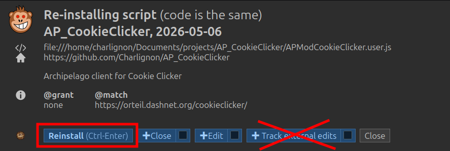
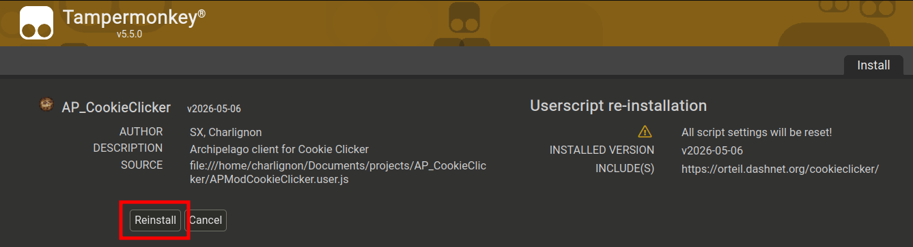
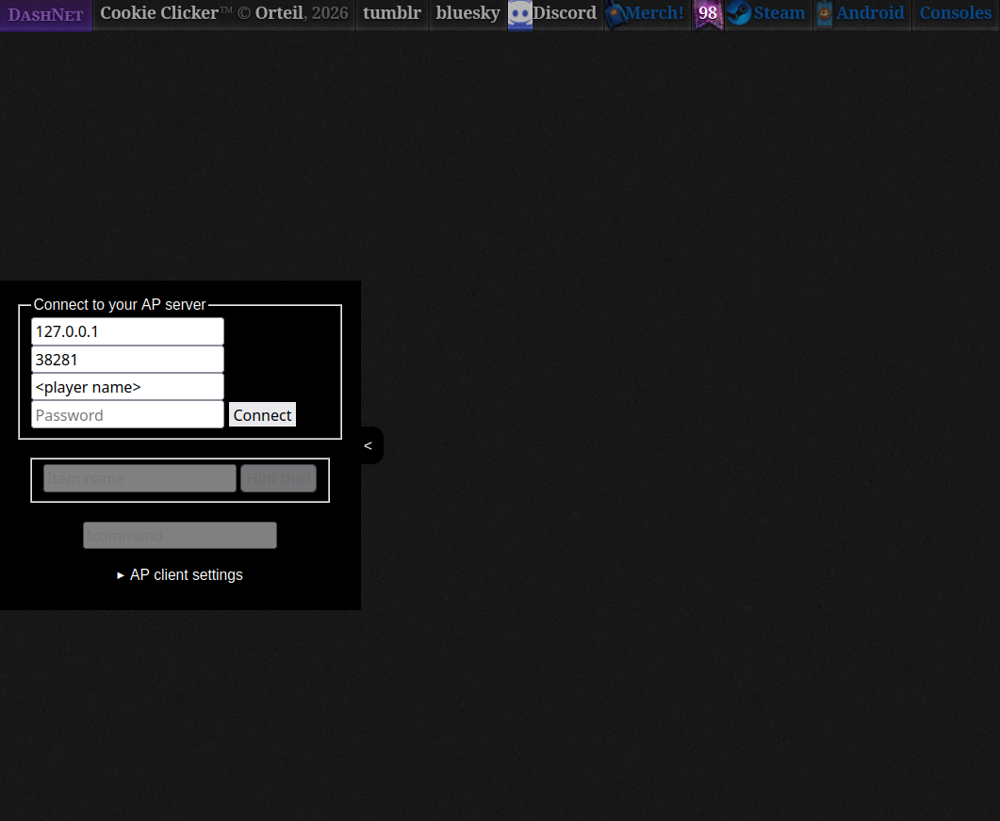

# Cookie Clicker Archipelago Multiworld Randomizer!

Everyone should know the little idle game named Cookie Clicker.
In CookieClicker Archipelago every building and upgrade has to be unlocked by a check
Every Achievement you make in the Game is a location, which unlock other's items

Have fun and feel free to make any pull requests 🍪

## Installation

For installation, I recommend using a browser addon such as [Violent Monkey](https://violentmonkey.github.io/) or [Tamper Monkey](https://www.tampermonkey.net/). They allow to sideload a Script into a website, which we use to modify the website.

- **Step 1:**
Go to your browser's addon store, and install ViolentMonkey or TamperMonkey (not both).
Tampermonkey might require you to set your Browser into Developer Mode

- **Step 2:**
Find the [latest release](github.com/Charlignon/AP_CookieClicker/releases/latest) of this Archipelago client, and click on `APModCookieClicker.user.js`

- **Step 3:**
A new page should open (illustration below). Install or reinstall the script 

For ViolentMonkey

⚠️ DO NOT ENABLE "Track external edits" ! This will auto-update your script, and you don't want that happening when you have an ongoing AP game :p

For TamperMonkey

> 🎉 **Finished**
> 
> Navigate to the [Cookie Clicker website](https://orteil.dashnet.org/cookieclicker/) (or reload the page), and it should look like this:
> 
> 

Just enter the Connection info and press "Connect" 

